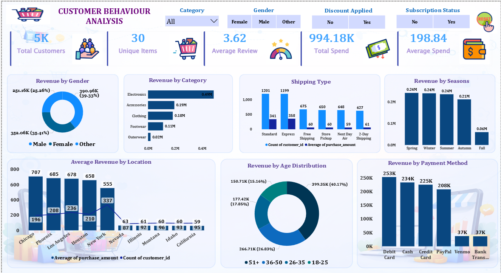
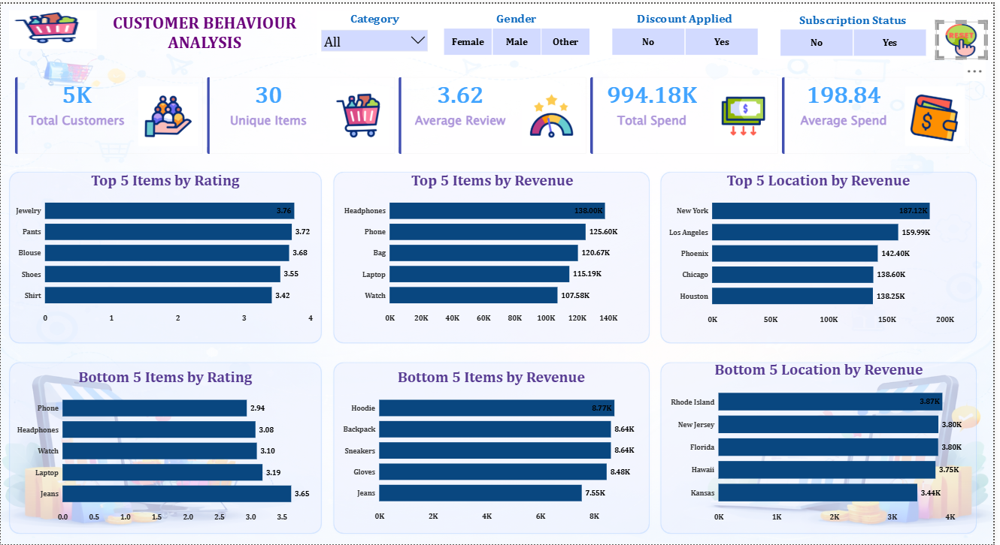

# Customer_Behaviour_Analysis_Project

## Retail & E-Commerce Customer Analytics 

An end-to-end customer analytics project built using Python, SQL Server, and Power BI to analyze customer purchasing behavior, revenue trends, discounts, subscriptions, shipping patterns, product ratings, and customer segmentation through interactive dashboards and business intelligence reporting.

---

# Dashboard Preview





---

# Project Overview

The Customer Behaviour Analysis project demonstrates a complete analytics workflow starting from raw customer transaction data and transforming it into actionable business intelligence insights.

The project focuses on:

* Customer Purchasing Behavior
* Revenue & Spending Analysis
* Discount & Promotion Analysis
* Customer Segmentation
* Product Rating Analysis
* Payment & Shipping Insights
* Interactive Dashboard Reporting

The workflow includes:

* Python Data Cleaning & EDA
* SQL Server Business Analysis
* Power BI Dashboard Development
* Business Insight Generation

---

# Business Problem

How can a retail company understand customer purchasing behavior to increase revenue, improve customer retention, and optimize marketing strategies?

The project addresses major business challenges such as:

* Low Customer Retention
* Ineffective Marketing Campaigns
* Product Demand Understanding
* Payment Behavior Insights
* Seasonal Demand Variation
* Customer Segmentation

---

# Dataset Information

| Attribute       | Details                     |
| --------------- | --------------------------- |
| Dataset Type    | Retail / E-Commerce Dataset |
| Nature          | Structured Tabular Dataset  |
| Level           | Customer Transaction Level  |
| Total Customers | 5,000                       |
| Unique Items    | 30                          |
| Domain          | Retail & Customer Analytics |

Dataset contains:

* Customer demographics
* Product information
* Purchase amount
* Payment methods
* Subscription status
* Discount usage
* Shipping details
* Review ratings

---

# Tools & Technologies Used

| Tool                | Purpose                 |
| ------------------- | ----------------------- |
| Python              | Data Cleaning & EDA     |
| Pandas              | Data Manipulation       |
| NumPy               | Numerical Operations    |
| SQL Server          | Business Analysis       |
| Power BI            | Dashboard Visualization |
| Jupyter Notebook    | Development Environment |
| SQLAlchemy + pyodbc | Python to SQL Export    |

---

# Project Workflow

```text id="9ld8jo"
Raw CSV Dataset
        ↓
Python Data Cleaning & EDA
        ↓
SQL Server Business Analysis
        ↓
Power BI Dashboard Development
        ↓
Business Insights & Reporting
```

---

# Python Data Cleaning Pipeline

The dataset was cleaned and transformed using Python and Pandas.

### Major Cleaning Operations

* Loaded dataset into Pandas DataFrame
* Performed exploratory data analysis
* Checked missing values
* Standardized column names
* Removed duplicate customer records
* Corrected category inconsistencies
* Handled missing review ratings
* Handled missing purchase values
* Cleaned categorical values
* Exported cleaned data to SQL Server

### Advanced Cleaning Logic

* Product-level mean imputation for ratings
* Category-specific size handling
* Customer-level deduplication
* SQL-friendly column formatting

---

# SQL Server Analysis

SQL queries were used to answer multiple business questions related to:

* Revenue Analysis
* Discount Impact
* Customer Segmentation
* Product Performance
* Shipping Analysis
* Subscription Behavior
* Product Ratings
* Revenue by Gender
* Revenue by Age Group
* Product Demand Analysis

### Key SQL Insights

* Electronics generated highest revenue ($486K)
* Subscribers spend 63% more on average
* Discounts increased average purchase value
* Debit Card was the most preferred payment method
* Loyal customers showed strong subscription behavior
* Age group 51+ generated highest revenue contribution

---

# Power BI Dashboard Features

The Power BI dashboard includes:

* KPI Cards
* Revenue by Category
* Revenue by Gender
* Revenue by Age Distribution
* Revenue by Payment Method
* Revenue by Seasons
* Product Rating Analysis
* Shipping Type Analysis
* Top & Bottom Product Analysis
* Location-Based Revenue Analysis
* Interactive Filters & Slicers

### KPI Cards

* Total Customers
* Unique Items
* Average Review
* Total Spend
* Average Spend

---

# Key Business Insights

* Total customer spend reached 994K USD
* Electronics dominated category revenue
* Subscribers spent significantly more than non-subscribers
* Debit Card generated highest payment revenue
* Spring, Winter, and Summer generated similar revenue trends
* Loyal customers contributed major repeat purchases
* Top-rated products included Gloves, Sandals, and Boots
* Phone and Headphones received lowest average ratings

---

# Repository Structure

```text id="cpxd4z"
Customer-Behaviour-Analysis/
│
├── dataset/
│   └── customer_shopping_behavior.csv
│
├── notebook/
│   └── customer_behavior_analysis.ipynb
│
├── sql_queries/
│   └── BUSINESS_INSIGHTS.sql
│
├── powerbi_dashboard/
│   └── customer_behaviour_analysis.pbix
│
├── report/
│   └── Report-Customer Behaviour Analysis.pdf
│
├── presentation/
│   └── Customer-Behavior-Analysis.pdf
│
├── screenshots/
│   ├── customer_behavior_analysis.png
│   └── customer_behavior_analysis 1.png
│
├── README.md
├── LICENSE
└── .gitignore
```

---

# Business Questions Solved

1. Which category generates the highest revenue?
2. Are discounts increasing purchase value?
3. Revenue contribution by gender
4. Customers spending above average with discounts
5. Top & bottom rated products
6. Standard vs Express shipping analysis
7. Subscriber vs non-subscriber spending analysis
8. Top products with highest discount usage
9. Customer segmentation analysis
10. Most purchased products by category
11. Repeat buyer subscription behavior
12. Revenue contribution by age group

---

# Future Scope

* Customer churn prediction
* Recommendation systems
* Real-time customer analytics
* AI-powered customer segmentation
* Marketing campaign optimization
* Customer lifetime value prediction

---

# Disclaimer

This project is created for educational and portfolio purposes only. The dataset used in this project is sourced from publicly available retail and e-commerce customer transaction records.

---

# Author

## Miryala Yashwanth

* Python
* SQL Server
* Power BI
* Data Analytics
